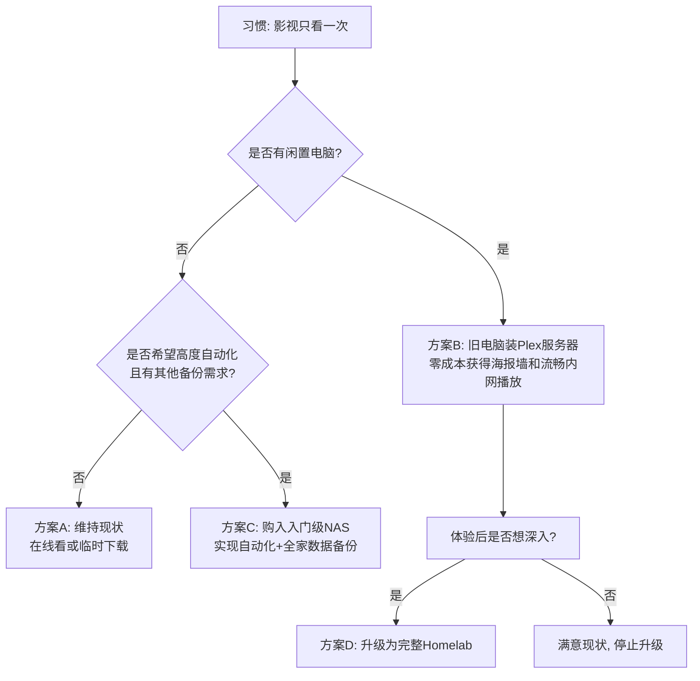

# Homelab搭建

从上到下，分别是8位PDU防雷排插、温控风扇、配线架、光猫、AC、UPS、NAS、软路由、硬盘盒。

**Homelab（家庭实验室）** 是指在家中使用各种硬件和软件设备，搭建的一个用于**学习、实验、开发或提供实际服务**的小型技术环境。它就像一个迷你版的个人数据中心或服务器集群。

---

### 🔍 **Homelab 的核心特点：**

1. **自我主导**：由个人完全掌控，从硬件选型到软件部署，自由度高。
2. **实验性质**：允许“折腾”、试错，不会影响生产环境，是学习IT技能的绝佳平台。
3. **实用与娱乐结合**：既可以运行实际服务（如家庭媒体库、智能家居中枢），也可以是纯粹的技术玩物。

---

### 🛠️ **一个典型的 Homelab 可能包含：**

| 组件 | 常见用途 |
|------|----------|
| **硬件** | 旧电脑/小型服务器/树莓派/NAS/网络设备（交换机、路由器） |
| **虚拟化/容器** | VMware ESXi、Proxmox VE、Docker、Kubernetes |
| **网络服务** | 软路由（OpenWrt/pfSense）、自建DNS、VPN服务器、防火墙 |
| **存储与备份** | TrueNAS、Nextcloud、Plex/Jellyfin（影音库）、备份系统 |
| **自动化与智能家居** | Home Assistant、Node-RED、自建IoT平台 |
| **开发与测试环境** | Git服务器、CI/CD流水线、测试数据库、Web服务器 |

---

### 🧠 **为什么人们要搭建 Homelab？**

- **学习与职业发展**：实践服务器管理、网络、虚拟化、云计算、安全等技能，对IT从业者尤其有价值。
- **数据自主与隐私**：将数据掌握在自己手中，替代部分云服务（如网盘、邮件、日历）。
- **成本控制与乐趣**：利用闲置硬件，以较低成本搭建个性化服务，享受“创造系统”的成就感。
- **家庭服务集成**：统一管理媒体库、下载机、智能家居、家庭监控等。

---

### 📦 **你列出的设备清单正是一个典型的 Homelab 配置：**

- **光猫 + 软路由**：控制网络流量，实现科学上网、广告过滤、多拨等。
- **AC**：管理无线AP，实现无缝Wi-Fi覆盖。
- **NAS + 硬盘盒**：提供大容量存储，用于影音库、文件同步、备份。
- **UPS**：保障停电时安全关机，保护设备。
- **PDU + 温控风扇**：提供稳定电源和散热，保证设备长时间运行。

**可以说，你正在搭建的正是一个功能齐全的 Homelab。**

---

### 🌱 **入门建议：**

如果对 Homelab 感兴趣，可以从以下起步：
1. 用一台旧电脑安装 **Proxmox** 或 **ESXi** 学习虚拟化。
2. 在虚拟机里运行 **Docker**，部署几个简单服务（如网页笔记、下载器）。
3. 慢慢扩展网络设备（如软路由）和存储设备（NAS）。
4. 关注社区（如 Reddit 的 r/homelab、国内“什么值得买”等）获取灵感。

**Homelab 的乐趣在于不断迭代和探索——它没有标准答案，完全按你的需求和兴趣定制。**

这是一个非常实际和理性的思考方向。**如果你的核心习惯是“只看一次”，并且对体验没有极致要求，那么从纯实用角度讲，确实没有必要为此专门搭建一套完整的NAS系统。**

但这并不等于“存储”和“流媒体”对你完全没用。我们可以更精细地分析你的场景，并找到更轻量、低成本的解决方案。

### ✅ **你的思路正确：避免过度投资**
NAS（特别是影音向）的核心价值在于**长期收藏、集中管理和高品质复用**。如果这两点都不是你的需求，花几千元搭建NAS就像为了喝一杯牛奶而养一头奶牛。

---

### 🔍 **但是，你可能忽略了这些潜在需求（值得思考）：**

1.  **“只看一次”是真的吗？**
    *   **经典佳作**：会不会几年后想重温？
    *   **系列剧集**：追到后面，是否想回顾前面剧情？
    *   **家人共享**：你看过一次，伴侣或孩子可能还没看。

2.  **“找到资源”的过程体验如何？**
    *   每次都需要花时间搜索、筛选、忍受满屏广告。
    *   下载速度不稳定，热门资源快，冷门资源可能极慢甚至无源。
    *   资源质量参差不齐（枪版、错误字幕、低码率）。

3.  **观看体验如何？**
    *   在线播放经常卡顿、缓冲。
    *   投屏到电视可能失败或画质压缩。
    *   在手机、电脑、电视间切换观看很麻烦。

---

### 💡 **针对“只看一次”的轻量级替代方案（从简到繁）**

根据你对体验和便捷性的要求，可以选择以下方案：

#### **方案A：最低成本，维持现状**
*   **做法**：继续使用网页在线观看或临时下载。
*   **优点**：零额外成本，零维护。
*   **缺点**：体验不可控，依赖外部资源站，有安全（恶意广告）和隐私风险。
*   **适合**：对画质、音质、便捷性要求极低，且不怕折腾的用户。

#### **方案B：轻度优化，提升体验（推荐起点）**
*   **核心**：**一台常开机的旧电脑/迷你主机 + 一个外置大硬盘**。
*   **做法**：
    1.  在这台电脑上安装 **Plex/Jellyfin/Emby 服务器端**。
    2.  把下载的影片拖入指定文件夹。
    3.  在电视/手机安装对应的客户端，直接播放电脑里的文件。
*   **优点**：
    *   极低成本（利用闲置设备）。
    *   获得**统一美观的海报墙**和**跨设备续播**体验。
    *   局域网内流媒体播放，比无线投屏更稳定、画质更好。
*   **这本质上是一个“软件NAS”或“媒体服务器”**，无需购买专用NAS硬件。

#### **方案C：兼顾存储与便利的中阶方案**
*   **核心**：**购买一个入门级双盘位NAS（如群晖DS224+、威联通TS-264C）**。
*   **做法**：除了方案B的功能，还能：
    1.  自动下载（配置Download Station、qBittorrent）。
    2.  自动整理和刮削信息（配置Sonarr/Radarr）。
    3.  **为手机照片、重要文档提供自动备份**（这是NAS的另一个核心价值）。
*   **优点**：
    *   设备专用，低功耗，7x24小时稳定运行。
    *   数据更安全（支持RAID 1）。
    *   功能全面，一机多用（不仅是影音）。
*   **这适合**：虽然影视只看一次，但希望过程高度自动化，并且有**其他数据存储备份需求**的用户。

#### **方案D：终极体验，一步到位**
*   **核心**：就是你清单里那种**自建服务器/高性能NAS + 强大解码能力**。
*   **适合**：最终往往会从“只看一次”变成“享受收藏和管理的过程本身”的技术爱好者。这时的乐趣已经从“消费内容”变成了“打造系统”。

### 📊 **决策流程图**

### ✨ **结论与建议**

1.  **不要**因为“可能”只看一次，就**直接否决**所有集中存储和流媒体方案。
2.  **强烈建议**从 **方案B（旧电脑+Plex Server）** 开始尝试。这几乎是零成本试错，能让你直观感受到“统一媒体库”和“内网流媒体”带来的便利，即使片子只放一次，**观看过程的体验也提升了**。
3.  如果你试过后觉得：“很方便，但我确实不需要更多功能了。” 那么方案B就是你的终点，无需再投资。
4.  如果你试过后发现：“哇，自动整理太爽了，我是不是还能用它备份手机照片？” 那么你可以顺理成章地考虑升级到方案C。

**最终，技术服务于需求。** 你的思路是务实的起点，而轻量级的方案B能帮你用最小成本验证，这个“服务”是否真的能提升你的生活质量。

对于 **100GB左右** 的个人资料备份需求，这是一个非常典型且轻量的场景。**最佳选择的核心是：在满足安全、便捷的前提下，追求最高性价比和最低维护成本。**

绝对没有必要为此购买高端NAS或搭建复杂服务器。以下是为你量身定制的分级方案：

---

### 🥇 **首选最佳方案：公有云 + 冷备份（性价比之王）**

这是最适合绝大多数普通用户的方案。

1.  **主力备份：选择一个可靠的公有云**
    *   **推荐**：**Google One**（100GB年费约$20）、**iCloud+**（如果你用苹果全家桶）、**微软OneDrive**（如果常用Office）、**百度网盘**（超级会员有加速）。
    *   **为什么**：
        *   **自动同步**：手机/电脑安装客户端后，指定文件夹自动备份，无需手动操作。
        *   **随处访问**：在任何有网络的设备上查看、下载文件。
        *   **版本历史**：主流服务都提供文件版本回溯（如误删、误改可恢复）。
        *   **成本极低**：年费远低于任何硬件投入。
        *   **足够安全**：对于非极端敏感的个人资料，大厂的加密和可靠性远超个人维护。

2.  **额外保险：一份本地冷备份**
    *   **做法**：每年或每半年，把所有重要文件拷贝到一块**移动硬盘**上，然后断开连接，妥善保存。
    *   **成本**：一块1TB的优质移动硬盘（如希捷、西数）约300-400元，可用多年。
    *   **作用**：防范极端情况（云服务商故障、账号被封、网络完全中断）。这是“3-2-1备份原则”的简化版。

**✅ 总结：这个组合年成本约200-300元，实现了自动化、异地、本地三重保护，几乎零维护，是你目前需求下的最优解。**

---

### 🥈 **次选方案：如果你极度注重隐私或网络环境特殊**

如果你完全不信任任何云服务商，或身处无法稳定访问国际云服务的环境，则选择 **“轻量级NAS”**。

1.  **设备选择**：
    *   **极简版**：**蒲公英X1** 等智能盒子 + 移动硬盘。成本<200元，能实现远程访问，但功能较弱。
    *   **经典版**：**群晖DS124** 或 **威联通TS-132C** 等**单盘位入门NAS**。成本约1500-2000元（含一块4TB硬盘）。
2.  **优势**：
    *   数据完全私密，保存在家中。
    *   NAS自带 **Synology Photos**、**Qfile** 等App，可实现手机照片自动备份。
    *   可以作为家庭的媒体库、下载机，扩展性较好。
3.  **劣势**：
    *   **成本陡增**：一次性投入是云服务10年的费用。
    *   **需要维护**：需设置网络、担心硬盘损坏（单盘位无RAID，需自己定期冷备份）。
    *   **远程访问依赖家中网络**：需要配置，速度和稳定性可能不如公有云。

**⚠️ 注意：这个方案的核心价值是“数据自主”和“功能扩展”，为100GB备份单独购买并不划算，除非你同时有其他需求（如轻度影音服务）。**

---

### 🥉 **可考虑方案：利用现有设备（零成本启动）**

如果你有一台**常年开机的旧电脑或迷你主机**，可以把它变成私人云。

1.  **做法**：
    *   在电脑上安装 **Synology Drive** 或 **Nextcloud** 等自建云软件。
    *   配置好动态DNS和端口转发，实现外网访问。
    *   手机安装对应App，设置自动备份。
2.  **优点**：零硬件成本，完全自主可控。
3.  **缺点**：技术门槛较高，需要维护系统安全和稳定，电费长期来看也是一笔开销。

---

### 📊 **决策指南：一张表帮你选择**

| 特性 | **公有云 + 冷备份** | **轻量级NAS** | **利用旧电脑** |
| :--- | :--- | :--- | :--- |
| **总成本** | **极低** (年费<300元) | **高** (一次性1500+) | **零** (但隐含电费) |
| **设置难度** | **极简** | 中等 | 较高 |
| **维护需求** | **无需** | 定期检查、更新 | 需维护系统、安全 |
| **数据隐私** | 交给服务商 | **完全自控** | **完全自控** |
| **访问便利性** | **最佳** (全球高速) | 依赖自家网络 | 依赖自家网络 |
| **额外功能** | 无 | 有（下载、影音等） | 有（可自由扩展） |
| **数据安全** | 高（服务商保障+本地冷备） | 中（依赖单盘，需自己冷备） | 低（旧电脑硬盘可靠性低） |

### 🎯 **给你的最终建议**

1.  **首选【公有云 + 一块移动硬盘冷备份】**。这是为你的需求量身定制的、最省心省力且足够安全的方案。100GB的数据量正是云服务最擅长的范围。
2.  **只有当以下条件满足至少两条时，才考虑购买入门NAS**：
    *   你对数据隐私有**极端**要求。
    *   你的网络环境无法顺畅使用国际云服务，且对国内云服务不信任。
    *   你**同时**有搭建家庭影音库、下载站、智能家居中枢等明确计划。
3.  **完全不必考虑**自建服务器、多盘位NAS等复杂方案，那是给数TB以上数据和有强烈技术探索欲的用户准备的。

**技术应该是生活的帮手，而不是负担。** 对于100GB的备份需求，用成熟、便宜的云服务解决问题，把时间和精力留给生活本身，才是真正的“最佳选择”。